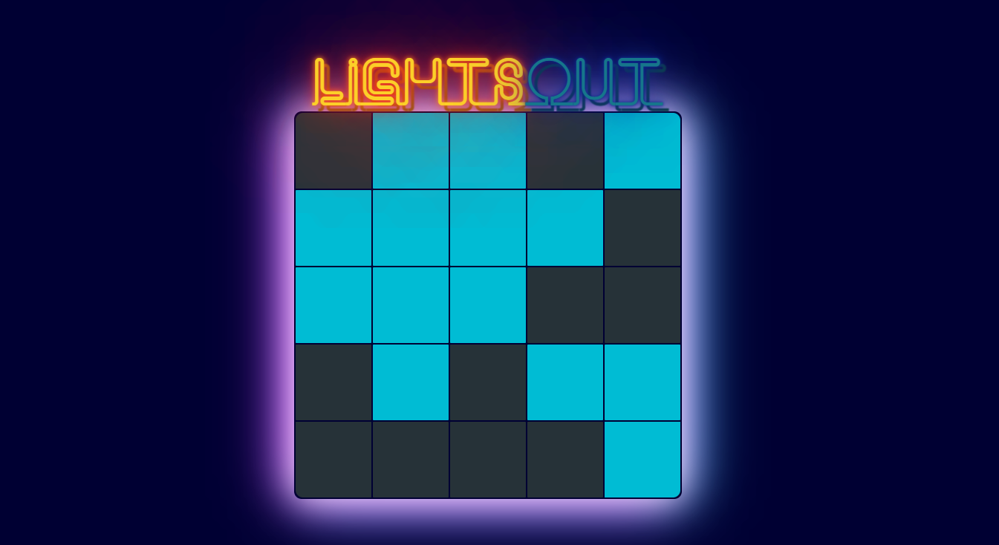

# Light Out

A simple game project where you need to put all the light on or off by clicking the boxes.

## Table of contents

- [Overview](#overview)
  - [The challenge](#the-challenge)
  - [Screenshot](#screenshot)
- [My process](#my-process)
  - [Built with](#built-with)
  - [What I learned](#what-i-learned)
- [Author](#author)

## Overview

### The challenge

Users should be able to:

- Interact with the light in the box
- When you click a box, it should turn on or off the box itself and four other boxes around it.
- When all the boxes are on or off, it will say "You Win!"

### Screenshot



## My process

### Built with

- Semantic HTML5 markup
- CSS custom properties
- Flexbox
- CSS Grid
- Javascript
- REACTJS

### What I learned

```css
@keyframes neon-orange {
  0%,
  100% {
    text-shadow: 0 0 1vw #fa1c16, 0 0 3vw #fa1c16, 0 0 10vw #fa1c16, 0 0 10vw
        #fa1c16, 0 0 0.4vw #fed128, 0.5vw 0.5vw 0.1vw #806914;
    color: #fed128;
  }
}
```

```js
function flipCell(y, x) {
  if (x >= 0 && x < ncols && y >= 0 && y < nrows) {
    board[y][x] = !board[y][x];
  }
}
```

## Author

- Frontend Mentor - [@manhtran1611](https://www.frontendmentor.io/profile/manhtran1611)
- Facebook - [@manhtranduc1611](https://www.facebook.com/manhtranduc1611)
